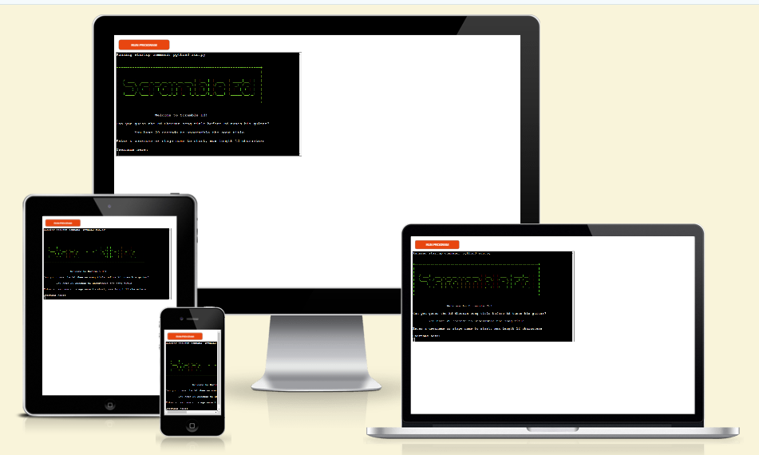
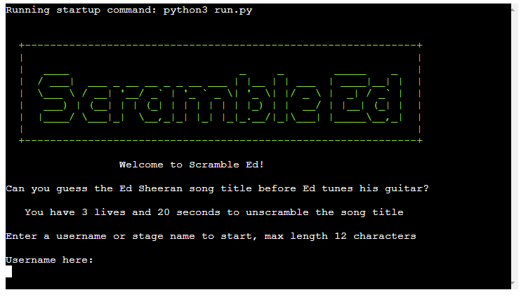
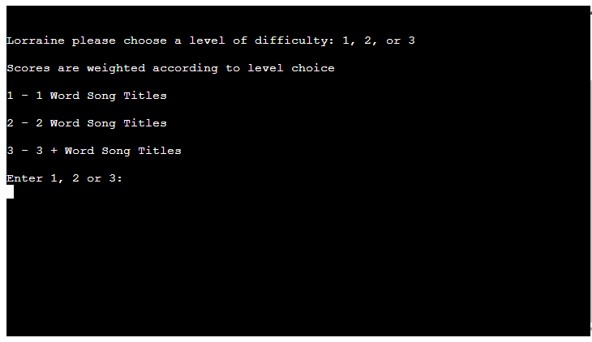
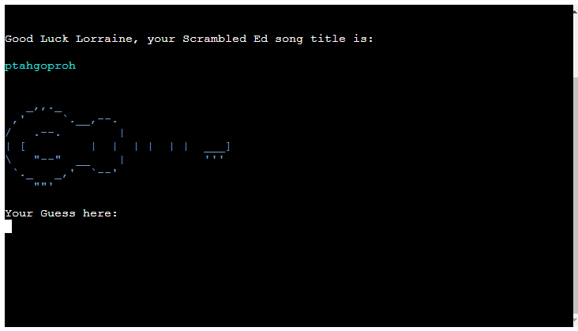
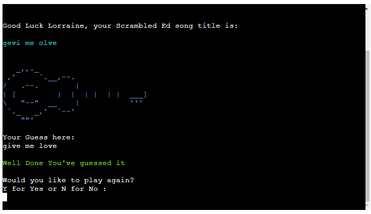
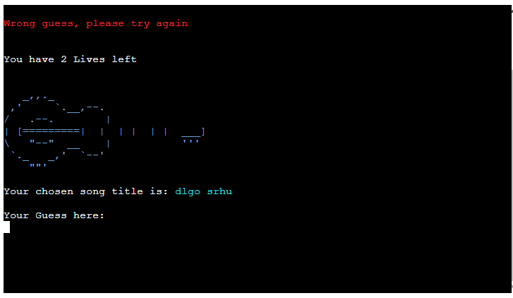
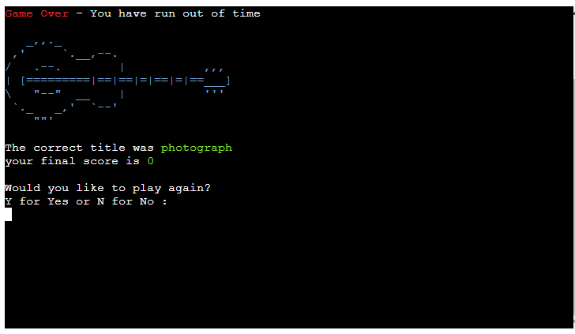
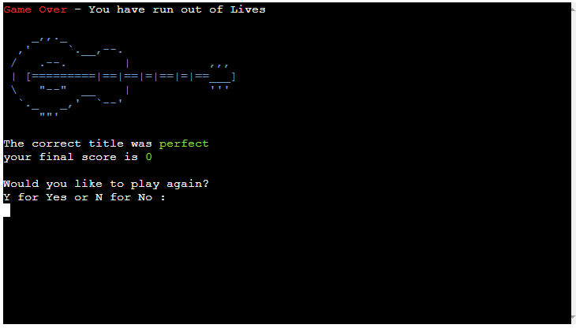
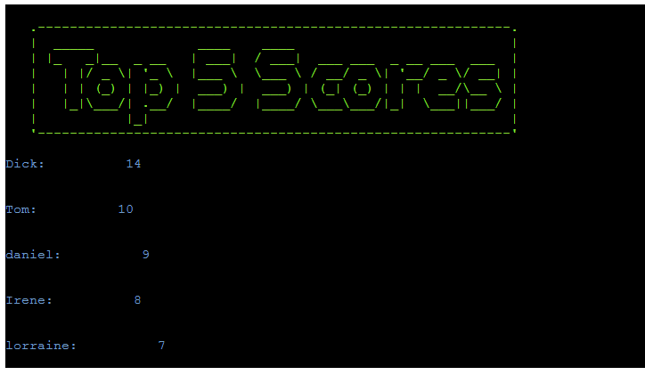

# Scramble Ed

## Code Institute - Portfolio Project 3 - Python Essentials

This website was created to demonstrate my ability to develop a command-line  application using Python.

Scramble Ed is an interactive terminal based word guessing game. The user tries to unscramble an Ed Sheeran song title before they run out of time or use up their lives.

### A live demo of the website can be found [here](https://scramble-ed-298bb66f3eff.herokuapp.com/)

## Demo

# Table of Contents
- [Scramble Ed](#scramble-ed)
  - [Code Institute - Portfolio Project 3 - Python Essentials.](#code-institute---portfolio-project3-python-essentials)
- [Table of Contents](#table-of-contents)
  - [Demo](#demo)
    - [A live demo website can be found here](#a-live-demo-of-the-website-can-be-found-here)
  - [UX](#ux)
    - [How to Play](#how-to-play)
  - [User Stories](#user-stories)
    - [Strategy](#strategy)
    - [Scope](#scope)
  - [Planning](#planning)
    [Design](#design)
  - [Technologies](#technologies)
  - [Features](#features)
    - [Existing Features](#existing-features)
    - [Future Features](#future-features) 
  - [Testing](#testing)
    - [Validator Testing](#validator-testing)
    - [Bugs](#bugs-encountered)
  - [Deployment](#deployment)
    - [Heroku Deployment](#heroku-deployment)
    - [Forking and Cloning](#forking-and-cloning)
  - [Credits](#credits)
    - [media](#media)
    - [Code](#code)
    - [Acknowledgements](#acknowledgements)

## UX
This appliaction is aimed at people who have an interest in word games and pop music. It aims to appeal to people of all ages as users can easily interact with the content and navigation is largely led by the application.

## User stories
- As a user I want the purpose of the website to be clear and immediate. This is achieved through the title banner and instructions visible on the landing page.
- As a user I want the application to be engaging and fun. I believe this has been achieved with the use of colour and ascii art.
- As a user I want to easily navigate between the different areas on the site. Navigation is logical and follows the course of the game.
- As a user I want to see what I've scored. This is achieved through the use of a score board that loads at the end of the game.
 

### Strategy
The goal is to create a fun and engaging word game. The focus is on presenting the content clearly and ensuring that the game is easy to follow. 

### Scope
To include features that enhance the user experience and provide value to the user. Features such as the ascii art and scoreboard hlep to achieve this.

## Planning
Flowchart Diagram
Excel spreadsheet on googledrive google API Setup

## Design
The application is desinged with a sequential structure which the user can navigate through with ease.

The user is presented with a landing page with an ascii heading 'Scramble Ed' and the rules of the game. The landing page allows the user to input a username to start the game. From here the user is taken through the steps in the game with the option to quit at various intervals. 

The design is limited as the application runs in a console window. 
- Ascii art has been used to display the game title, scoreboard heading and guitar images. 
- Different colour text has been used to enhance the user experience.
- The scrambled word appears to the console using a typewritter effect.
- The game over banner is printed to the console with a quicker typewritter effect

## Technologies
- Python - To create the application.
- Google Cloud - created project and linked it to google drive spreadsheet using API
- Google sheets - spreadsheet containing song titles, username and score details

### Libraries
In addition to the standard Python libraries I used the following libraries and modules. 

 - gspread : allows us to read and write data to the spreadsheet.
 - random : a module containing a number of random number generation-related functions
 - array : allows us to create arrays in python.
 - time :  allows us to create time related tasks.
 - sys :  provides access to system-specific parameters and functions.
 - google.oauth2.service_account : allows access to the google API

## Features 
The following features are included on the website.

### Existing Features

- __Landing Page__
  - The landing page includes an ascii text banner displaying the title 'Scramble Ed'. 
  - This section lists the game rules and prompts the user to enter a username of their choice.
  - The user must enter a username in order to continue.
  - Validation is used to ensure the username is not blank and does not exceed 12 characters in length.

- __Level Choice__
  - The user is presented with list of diffculty levels from 1 to 3.
  - 1 returns a one word song title.
  - 2 returns a two word song title.
  - 3 returns song titles with three or more words.
  - Input is validated and returns an error if anything other than 1, 2 or 3 is entered.

- __Game Play__
  - The user is presented with a welcome meassage and the scrambled song title is printed, typewritter style in a cyan text colour.
  - An ascii art piece is printed, this is a guitar missing its strings.
  - The user has 20 seconds and 3 attempts to guess the title. 
  - The user is prompted to enter a guess

-__Correct Answer__
  - If the users guess is correct they are presented with a Well done message.
  - The user is presented with the option to play again or not.
  - If they select yes another scrambled title is presented to the user.
  - If they choose no their scores are sent to the spreadsheeet, a game over banner is displayed followed by the scoreboard.

   

-__Incorrect Answer__
  - If the users guess is incorrect they are presented with a message telling them wrong guess try again.
  - The user loses a life.
  - The guitar image is updated by adding a string
  - Each life lost adds a string to the guitar.

-__Out of Time__
  - If the user fails to guess correctly before the 20 secoonds timer is up they get the game over message.
  - The ascii guitar is printed with all its strings. 
  - Their scores are written to the spreadsheet.
  - The user is asked if they would like to play again.

-__Out of Lives__
  - If the user looses all their lives they are presented with the game over message.
  - The ascii guitar is printed with all its strings. 
  - Their scores are written to the spreadsheet.
  - The user is asked if they would like to play again.
  

- __Game Over__
  - The game over ascii banner is printed to the screen using a typewritter effect.
  - It appears for a short number of seconds before being replaced by the scorebord.

-__Score Board__
  - The scoreboard consists of an ascii banner the the top 5 scores from the spreadsheet printed to the console.

### Future Features
- Improve the timer function to interrupt the game when the time is up. 
- Allow users to gain extra score points for time left over.
- Improve the scoreboard display to include a table.

## Testing
- This application has been tested on different browsers such as Chrome, Firefox and Microsoft Edge.
- It has passed lighthouse testing for performance, accessibility, best practices and search engine optimization. 

### User/ manual Testing

### Validator Testing 
- All code has passed through the [Code Institute Python Linter](https://pep8ci.herokuapp.com/)
[runpy](docs/images/runpyValidated.jpg)
[artpy](docs/images/artpyValidation.jpg)
[colours](docs/images/coloursValidated.jpg)

## Bugs Encountered
- On earlier tests I noticed that some titles were returned readable after being scrambled. Like bam bam and lego house. I added and if statement to the split and scramble function to return the scrambled title only if it was not equal to the title otherwise run the function again.
- When validating the code in the Python Linter I ran into some console errors relating to the use of escape sequence characters in the ascii art I had used. 
W605 invalid escape sequence '\_' 
Putting an r before the images solved this problem.
- I also encountered errors where I had exceeded 80 characters per line. 
E501: line too long. I resolved these by breaking up the lines with \ where appropriate. I also shortened variable names I had given to apply colours as these  were used in a lot of my strings.
- The timer function doesn't currently perform how a user might expect. The function is called at various points when the user interacts with the game but does not interrupt play when time runs out. I would need to run the timer function along with other functions simultaneously to achive this. I believe there is a way using threading, unfortunately this was beyond my skills at this time but would be something I would like to implement in the future. 

### Unfixed Bugs
- 

## Deployment
### Heroku Deployment
- The site was deployed to Heroku, the steps used were as follows: 
  - Create and login to your heroku account. 
  - On your heroku dashboard, click the new button and 'create new app' from the dropdown menu.
  - Enter the name of the app 'scramble-ed', select region as 'Europe' and click the 'Create app' button
  - On the app screen select the 'Settings' tab.
  - Find the 'Config Vars' section and enter the following: 
  KEY :Port and VALUE: 8000
  - Now find the 'Buildpacks' section and add the 'Python' and 'Node.js' buildpacks. They need to be added in order, Python first and the Node.js.
  - Scroll back to the top of this page and find the Deploy tab. 
  - On this page find 'Deployment method' and select 'GitHub'.
  - In the 'Connect to Github' section enter the name of your repository and click 'Connect'.
  - On the deploy page select your preferred deployment type I choose 'Enable Automatic Deploys'.
  - The app will be built on your next push to github.
  - Once created the app appears on your heroku dashboard. 
  - Click on app and your dashboard and 'Open app' from the app page. 
  - The app opens in a console loaded in a browser window.

### Forking and Cloning
You can choose to fork or clone your project for development purposes. Forking creates a separate repository that shares code and visibility settings with the original repository. You can make changes to a forked repsotitory without affecting the original repository.
You can clone your repository to create a local copy on your computer and sync between the two locations. Changes made to a clone repository will affect the original repository.

To Fork
- Log in to GitHub.
- Find the repository for your project.
- Click the Fork button in the top right corner of the screen.

To Clone
- Log in to GitHub.
- Find the repository for this project.
- Click the Code button and select whether you would like to clone with HTTPS, SSH or GitHub CLI. Copy the link displayed.
- Open the terminal in your code editor and change the current working directory to the location you want to use for the cloned directory.
- Type 'git clone' into the terminal and then paste the link you copied in the previous steps. 

## Credits 
The following is a list of resources that were used for this website.

### Media
- ASCII art by Harry Mason at [ASCII Art Archive](https://www.asciiart.eu/)
- For creating the flow chart I used

### Code
 - Template used was [Python Essentials Template](https://github.com/Code-Institute-Org/python-essentials-template) provided by the Code Institute
 - I used the following discussion to help create my function to scramble the song title strings [Stack Overflow](https://stackoverflow.com/questions/6181304/are-there-any-ways-to-scramble-strings-in-python) 
 - I used the following article as a basis for my typewritter function. [Python in Plain English](https://python.plainenglish.io-typewriter-animation-using-python-7f4275e812bf)
 - I used code at the following source to create my clear function. [Geeks for Geeks](https://www.geeksforgeeks.org/clear-screen-python/)
 - ASCII art by Harry Mason at [ASCII Art Archive](https://www.asciiart.eu/)
 - I used code found at the following thread to create my colour class [Stack Overflow](https://stackoverflow.com/questions/287871/how-do-i-print-colored-text-to-the-terminal)

### Acknowledgements
- I am gratefull to the Code Institute tutor support team for helping and guiding me in the right direction.
- A special thanks to my mentor Medale Oluwafemi for his guidance and great advice.

[def]: 
